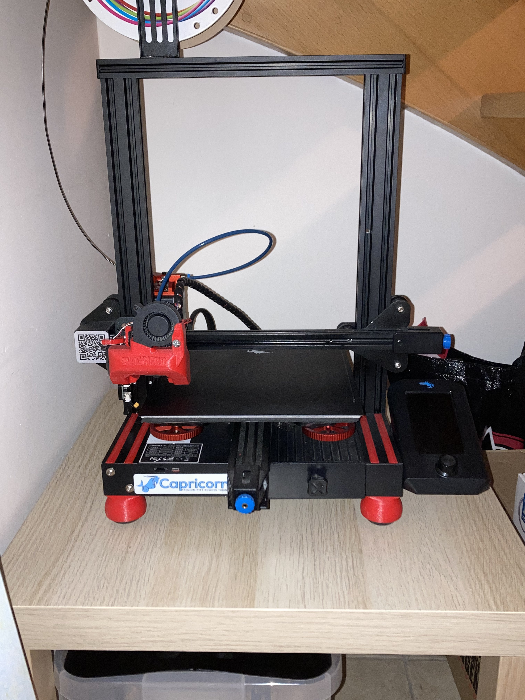

# Ender 3V2 changelog
## Physical upgrades
The following upgrades are done:
* Mainboard upgrade: [BTT SKR Mini E3 V3](https://biqu.equipment/collections/control-board/products/bigtreetech-skr-mini-e3-v2-0-32-bit-control-board-for-ender-3)
* Heated bed insulation: [Cotton thermo mat](https://www.amazon.com.be/-/nl/dp/B09LHK7VLL?psc=1&ref=ppx_yo2ov_dt_b_product_details)
* Heated bed surface: [Magnetic print bed](https://www.amazon.com.be/-/nl/dp/B08VS37RMP?psc=1&ref=ppx_yo2ov_dt_b_product_details)
* Stepper motor cooling: [Aluminium heatsink](https://www.amazon.com.be/-/nl/dp/B09JK2W7SK?psc=1&ref=ppx_yo2ov_dt_b_product_details)
* Bed leveling:
    * [Levelling screws and springs](https://www.amazon.com.be/-/nl/dp/B09B723VC4?psc=1&ref=ppx_yo2ov_dt_b_product_details)
    * [CR touch probe](https://store.creality.com/eu/products/cr-touch-auto-leveling-sensor-kit?cfb=6fcb19a0-203a-4006-841d-2aa5b4ad70ee&ifb=6fcb19a0-203a-4006-841d-2aa5b4ad70ee&scm=search.v39.101.102.103.104&score=1&ssp=&spm=..search.search_1.1)
* Hotend: [Micro Swiss ll metal hotend](https://www.123-3d.nl/MicroSwiss-Micro-Swiss-All-Metal-Hotend-Kit-voor-CR-10-Ender-3D-Printers-M2583-04-i3536-t14792.html)
* Nozzle: [Micro Swiss coated nozzle 0.6mm](https://www.123-3d.nl/MicroSwiss-Micro-Swiss-Messing-gecoate-nozzle-voor-MK8-Hotend-1-75-mm-x-0-60-mm-M2549-06-i3553-t13090.html)
* Metal extruder: [Redrex dual gear extruder](https://www.amazon.com.be/-/nl/Redrex-Extruder-versnelling-Neo-serie-CR10-serie/dp/B09H6T3NNT/ref=sr_1_1?crid=WQ8X2DGY8KP4&dib=eyJ2IjoiMSJ9.WIISyPhbsEW3rNcV6EmZpuRWODbFYcLj3bzcymRGk9-JK32KIVnbrsznfuceSCb3eBvPTfRkHnfz2_6Pq_YGl2q5wzzpmuaSBzjzH2XnFDpFOb725yKknaxDKazhVbOg8LQcghuCU6cl5udVreEFQKX9_9ThuVAB_rYtYQseAPCL3gOA4e3vaPG0A30G1NsM_d8FrbbSApCBbByde5M34TcXQh2MUvO0BkktfsC2Hc0Dlmf_J9B-w13xqfe669oT0uDDQ4BZVCCknAkh4LHoCyjzxhiZ53SPK5k3lkrdT90.wdTVboGNrNMfO8KMVbwFaxC_VhKghuMT5BxmtDX3WPw&dib_tag=se&keywords=dual%2Bgear%2Bextruder%2Bender%2B3%2Bv2&qid=1713113267&sprefix=dual%2Bgear%2Bextruder%2Bender%2B3v2%2Caps%2C70&sr=8-1&th=1)
* Bowden tube: [Capricorn bowden tube + fittings](https://www.amazon.com.be/-/nl/Sovol-Capricorn-Pneumatische-buissnijder-3D-printer/dp/B086YPDHMF/ref=sr_1_1?crid=1TKUMVAOIT06K&dib=eyJ2IjoiMSJ9.5U-Q17sdXHitk4yVMQF5g2xI6fzlID5rEvc1smuQaocX_Asr8z7MWfbQdt0B3KyPrjd4q49OtdcJ-XFvlkQu_uMtG9MdYbfhOWGL4TLoED-F71uvXsjDSUiB1i4i509eaF4du_P3RWlcmGgddLRWR9xSgjAe9FKxzXc82RRtNo1quh0rO2DGPBChak_ybCeI7CuyGXUjgTf9hI_USmaGczCop_qUahnigLE74-nJvP-6NrFCq_gbWUZpTuf7GzvQzo3r7MB8w1hAvxWvXoIBiehIQwUQT2aTtADpMA7hfi8.DBUpyOi6rfPGzxSO0TpLlPQOEg5soCZxxFNkSVCSr7E&dib_tag=se&keywords=capricorn+bowden+tube&qid=1713113384&sprefix=capricorn+bowden+%2Caps%2C74&sr=8-1)

## Printed upgrades
Some upgrades are free of charge and your prints can benefit from it greatly. I printed everything using **PETG** from [REAL filament](https://real-filament.com/3d-filament/petg).

* Antivibration feet using squashballs at [Thingiverse](https://www.thingiverse.com/thing:4694637).
* Slot covers at [Thingiverse](https://www.thingiverse.com/thing:4579489)
* Petsfang Blokhead fan duct at [Thingiverse](https://www.thingiverse.com/thing:4868204)

## Software upgrades
* MriscoC firmware: Currently I run this build from January 2024 from [Github](https://github.com/mriscoc/Ender3V2S1/releases/tag/20240122).
* I also upgraded the firmware of the screen to enable the color display and print thumbnails. This is also found over at [Github](https://github.com/mriscoc/Ender3V2S1/wiki/How-to-update-the-display).

# Tips
* It is advised to follow [this calibration guide from MriscoC](https://github.com/mriscoc/Ender3V2S1/wiki/Calibration-Guides) everytime you make changes to something that has an impact on extrusion.

# Selfie
